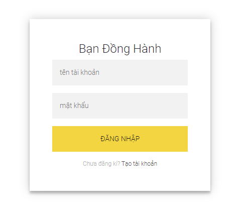
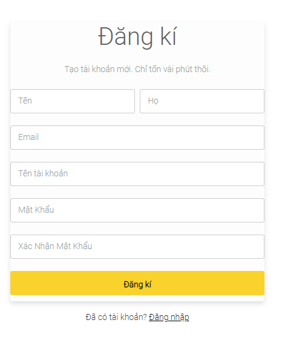
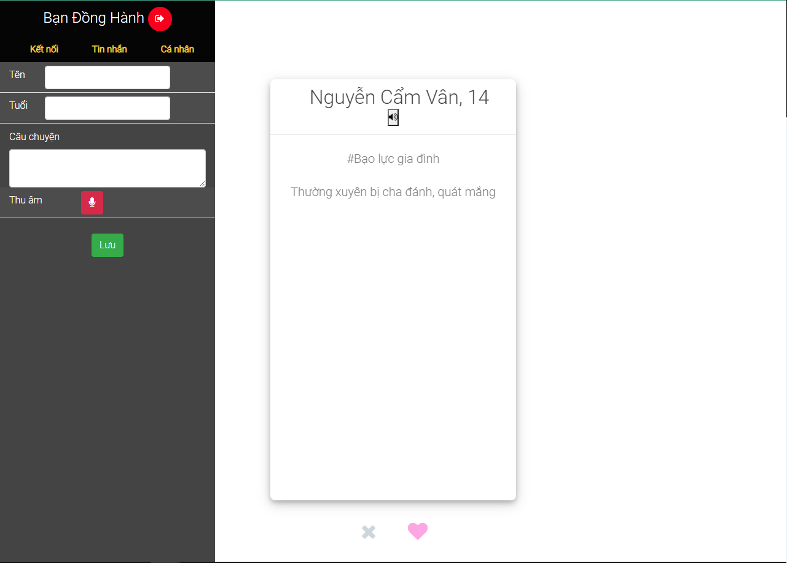
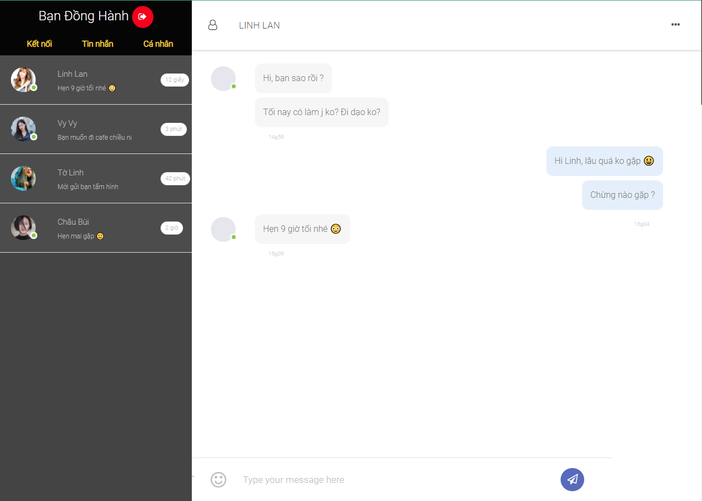
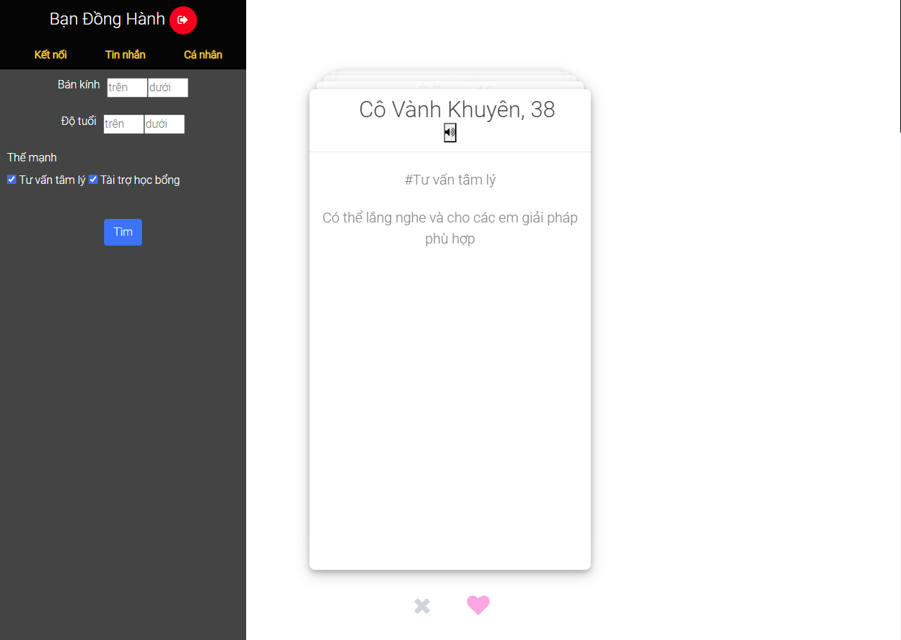

# SheCodes 2021 - App Bạn Đồng Hành

## Vấn đề
Ý tưởng này xuất phát từ vấn đề hiện tại của xã hội Việt Nam đang trong thời gian giãn cách xã hội. “Theo thống kê của Bộ Lao động - Thương binh và Xã hội, chỉ tính riêng trong tháng 4/2020 (thời gian thực hiện giãn cách xã hội), Tổng đài quốc gia bảo vệ trẻ em 111 đã tiếp nhận 750 cuộc gọi đề nghị trợ giúp, trong đó hơn 200 cuộc cần sự can thiệp về bạo lực gia đình, xâm hại trẻ em và những vấn đề liên quan đến sang chấn tâm lý.

Theo Quỹ Nhi đồng Liên hợp quốc UNICEF, ở nhiều quốc gia trên thế giới, bạo lực gia đình cũng tăng từ 30% - 300%.”

Chúng ta cũng thấy trong xã hội có những trẻ em chưa định hướng được tương lai, không dám sống thực với ước mơ vì rào cản gia đình và xã hội, cần hỗ trợ về tài chính để tiếp tục đi học, hoặc các trẻ bị bạo lực gia đình, bạo lực học đường, không dám chia sẻ với gia đình, người thân.

Mong muốn sẽ xây dựng được một thế hệ trẻ tự tin, dám thực hiện ước mơ, giảm đi các trường hợp trẻ tự tử vì áp lực học tập, mắc bệnh tâm lý, hỗ trợ các trường hợp hiếu học nhưng không có điều kiện học tiếp. Xây dựng đội ngũ Người đồng hành kế thừa từ những trường hợp trẻ cần được hỗ trợ đã thành công và muốn quay lại đóng góp cho hoạt động này

## Giải pháp

App Bạn Đồng Hành kết nối trẻ em gái và người đồng hành.

Người đồng hành là những tình nguyện viên chia sẻ với các em câu chuyện về sự phát triển của họ, cách họ đối đầu với thành công và thất bại. Thắp lên động lực phát triển, khuyến khích và khơi gợi ước mơ trong tiềm thức của trẻ bên cạnh đó cũng là người tư vấn tâm lý, hoặc dạy các em những kỹ năng, kiến thức cần thiết với cuộc sống.

## Mô tả sản phẩm

Giao diện được dựa trên Tinder app. Trẻ em gái có thể lựa chọn người để chia sẻ bằng cách quẹt trái hoặc quẹt phải những tấm thẻ chứa thông tin của người bạn đồng hành. Ngoài ra có thể giảm số lượng người được tìm kiếm qua chức năng filter. Tương tự cho người đồng hành. Điểm khác biệt là thay vì tấm thẻ chứa hình ảnh, thì được thay bằng câu chuyện của trẻ em gái, giới thiệu ngắn gọn và thế mạnh của bạn đồng hành, thu âm câu chuyện được kể từ người thật,... 2 người tương thích có thể kết nối với nhau thông qua chức năng chat/call.

|   |  |
|:---:|:---:|
| Đăng nhập | Đăng kí |

 

|   |  |
|:---:|:---:|
| Chỉnh sửa thông tin cá nhân | Nhắn tin |

 

|  |
|:---:|
| Kết nối |

### Tham khảo:

- Login: https://codepen.io/colorlib/pen/rxddKy
- Register: https://codepen.io/Nupur16/pen/JjEWGre
- Swipe card:
    - https://codepen.io/RobVermeer/pen/japZpY
    - https://codepen.io/greg-forster/pen/BxGypN
- Chat: https://codepen.io/ThomasDaubenton/pen/QMqaBN

